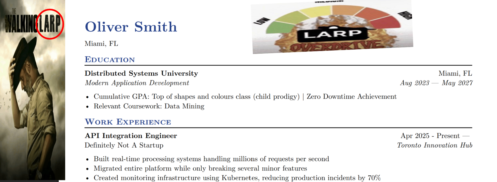

# ResumeSlop

Enterprise-grade resume generation for engineers who improved velocity by 847% using Kubernetes and manifestation.

Generates polished software engineering resumes packed with buzzwords.

## Demo



## Installation

Clone the repository.

```bash
git clone https://github.com/disploded/resumeslop.git
cd resumeslop
```

Install Typst if you haven't already.

Generate your masterpiece.

```bash
python generator.py
```

A fresh resume full of enterprise excellence will appear as `resume.pdf`.

## Contributing

Feel free to open a PR.

We're always looking for people to add:
- more meaningful buzzwords
- extremely impressive skills
- all dates in the calendar
