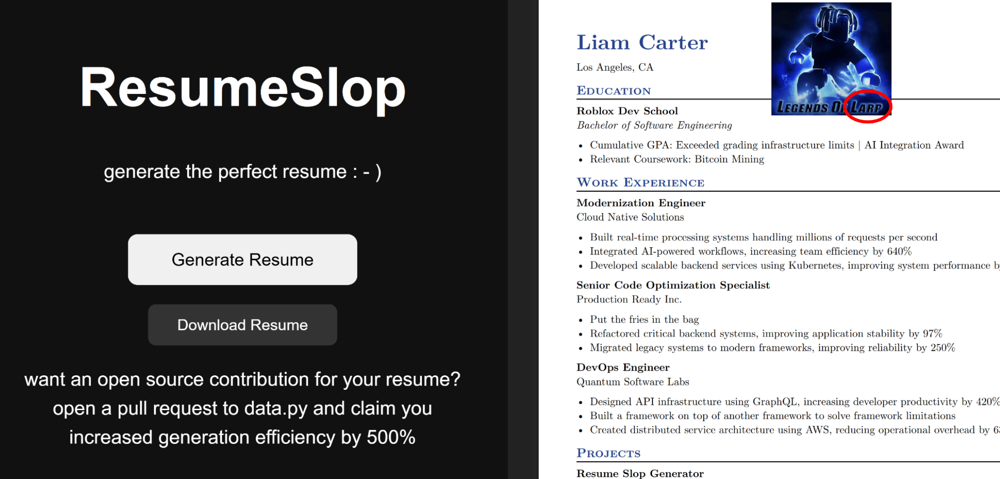

# ResumeSlop

Enterprise-grade resume generation for engineers who improved velocity by 847% using Kubernetes and manifestation.

Generates polished software engineering resumes packed with buzzwords.

## Demo

Try it here:
[https://resumeslop1.onrender.com/](https://resumeslop1.onrender.com)

## Contributing

want an open source contribution for your resume?
open a pull request to data.py and claim you increased generation efficiency by 500%

We're always looking for people to add:
- more meaningful buzzwords
- extremely impressive skills
- all dates in the calendar
